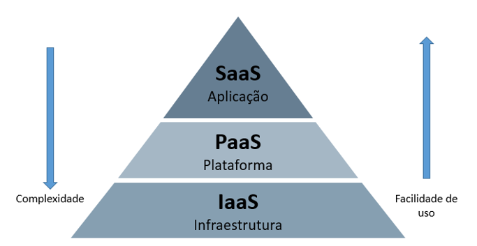

# Introdução à computação em nuvem
  
**Por Luiz Gontijo**  

O artigo busca introduzir o conceito da computação em nuvem, assim como os principais serviços disponíveis nesse tipo de computação e seus principais benefícios. 
  
## O que é a computação em nuvem?
  
A computação em nuvem, ou Cloud computing, é a entrega de serviços ou recursos tecnológicos por meio da Internet. Ou seja, em vez de comprar e manter datacenters físicos, você pode acessar esses serviços de tecnologia, como capacidade computacional, armazenamento e banco de dados, conforme sua necessidade, usando um provedor em nuvem como a AWS, Azure ou Google Cloud.

## Benefícios da computação em nuvem

### Mais velocidade e agilidade para inovações e implementações

O provisionamento de recursos na nuvem acontece de maneira mais rápida, o que acelera a velocidade de testes e desenvolvimento, uma vez que o serviço está “a um clique de distância”.

### Substituição de despesas fixas por variáveis

A computação em nuvem segue o modelo de “pay-as-you-go”, ou seja, você paga conforme o uso, sem necessidade de realizar investimentos prévios. 

### Não tem a necessidade de previsão da capacidade

Em um ambiente fora da nuvem, é necessário tomar a decisão de capacidade antes de desenvolver uma aplicação e isso faz com que alguns recursos fiquem ociosos, gerando custos desnecessários. Já na Computação em nuvem é possível escalar a capacidade conforme a necessidade momentânea.   
  
## Tipos de computação em nuvem

### IaaS (infraestrutura como serviço)

O IaaS mantém os componentes básicos da infraestrutura na nuvem. Geralmente, esse tipo de Cloud oferece serviços como computadores virtuais, acesso a recursos de rede e armazenamento de dados. Ele é o tipo de computação mais parecido com os recursos já existentes de TI, uma vez que o gerenciamento da infraestrutura subjacente (hardware, sistemas operacionais, subdivisões de disco...) continua na mão dos utilizadores.
  
### PaaS (plataforma como serviço)

Utilizando o PaaS, o utilizador não precisa mais gerenciar a infraestrutura subjacente e pode, dessa forma, focar na implementação e no gerenciamento de suas aplicações. Sendo assim, o planejamento de capacidade, a manutenção de software, a atualização dos sistemas se torna papel do provedor de nuvem contratado.  

### SaaS (Software como serviço)

O software como serviço é um modelo de software baseado em nuvem, que entrega aplicações aos usuários finais por meio de um navegador da Internet. Dessa maneira, os fornecedores de SaaS hospedam serviços e aplicações para que os clientes acessem sob demanda, sem que o utilizador tenha que pensar em como a infraestrutura subjacente é gerenciada.

## Materiais complementares

- https://docs.aws.amazon.com/pt_br/whitepapers/latest/aws-overview/six-advantages-of-cloud-computing.html

- https://azure.microsoft.com/pt-br/resources/cloud-computing-dictionary/types-of-cloud-computing 

- https://nvlpubs.nist.gov/nistpubs/legacy/sp/nistspecialpublication800-145.pdf 
